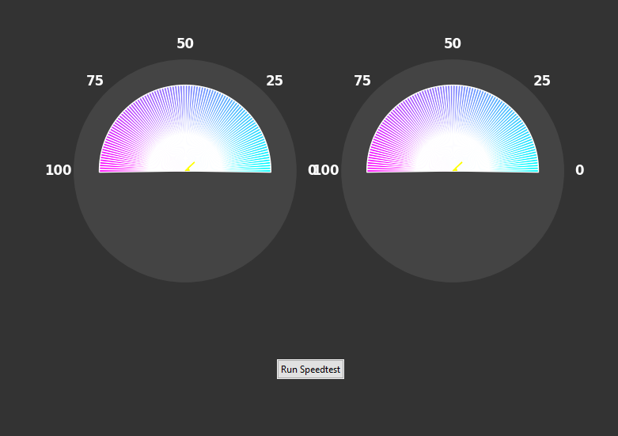

# Speedtest GUI



This project is a graphical user interface (GUI) for running internet speed tests using the `speedtest-cli` library. The GUI is built with `tkinter` and visualizes the download and upload speeds using `matplotlib`.

## Features

- Run internet speed tests
- Visualize download and upload speeds with animated gauges
- Display results in Mbps

## Requirements

- Python 3.x
- `speedtest-cli`
- `tk`
- `numpy`
- `matplotlib`

## Installation

1. Clone the repository:

    ```sh
    git clone https://github.com/Varp0s/tool-collections/edit/main/speedtest
    cd speedtest-gui
    ```

2. Install the required packages:

    ```sh
    pip install -r requirements.txt
    ```

## Usage

Run the `main.py` script to start the GUI:

```sh

python main.py

```
